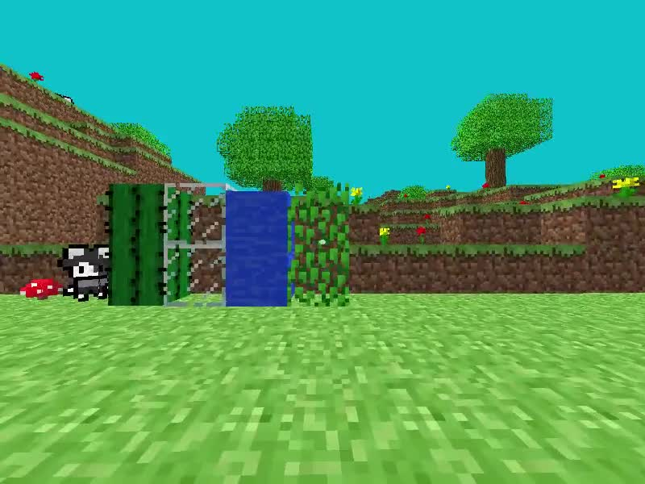
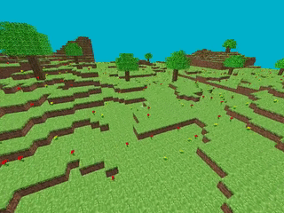

# Vakraft




# Current State
This project is currently in an active development phase. It is in its early stages of creation and is not yet considered playable.
 Thank you for your interest in this provisional-named project, and please stay tuned for further developments!

# Overview
Vakraft is developed using the *Lightweight Java Game Library* (`LWJGL`).
This project aims to create a Minecraft-inspired game for the purpose of learning `OpenGL`.

# Current state
This project is currently in an active development phase. As of the latest update, it is in its early stages of creation and is not yet considered playable. 

# How it Works
The game's core functionality is divided into key components:

### Main Classes
- **Engine.java:** This class serves as the central hub of the game, housing game loop.
 It manages the execution of methods defined in `Game.java` (via the `IGameLogic.java` interface) within the game loop
- **Game.java:** This class contains all the essential game logic, handling mechanics such as player movement and world generation.
 It forms the foundation upon which the entire gameplay experience is built

### Key Directories
- **game/:** Within this directory, you'll find classes that directly impact in-game elements and mechanics.
 These classes contribute significantly to the game's interactive features and overall functionality.
- **engine/:** This directory hosts classes responsible for managing the game's core functionality.
- **render/:** In this directory, you'll discover all the necessary methods for rendering in-game elements,
 including textures, shaders, and meshes.

# How to Compile and Play
Please ensure that you have `Gradle` installed and are using `Java 8` or newer

## Compile and Run
You can compile and run the game using one of the following methods:

### Using the Provided Compile Script
Execute the following commands using the provided compile script:

```sh
bash run.sh -r # Use -c to compile to a JAR file
```

### Using Gradle
```sh
./gradlew run
```

### Running the JAR File
>WARNING: Check for the correct `jar` name
```sh
java -jar vakraft.jare
```

# Controls
- `WASD` - Movement
- `E` - Next block
- `Q` - Previous block
- `Shift` - Fly down
- `Space` - Fly up
- `TAB` - Get cursor
- `ESC` - Close window

# TODO
## Main focus
- [X] Terrain generation (*Started*)
- [ ] Procedural generation
- [ ] Change `Model` to interface (*maybe*)
- [ ] Add subchunks (*maybe*)
- [ ] Light
- [ ] Shader improvement

## Fix bugs
- [X] Fix "*Keyboard Input*" bug
- [ ] Fix mouse movement

## Not my focus now
- [X] Load blocks from file (*maybe*)
- [ ] Collision
- [ ] Gravity
- [ ] Save/Load (*maybe*)

# Credits
Made by me<br>
The project structure is inspired by [StartForKiller/JavaMinecraft](https://github.com/StartForKiller/JavaMinecraft)<br>
`NoiseGeneration.java` and `PerlinNoiseGeneration.java` author: https://github.com/Bukkit/Bukkit/tree/master/src/main/java/org/bukkit/util/noise
